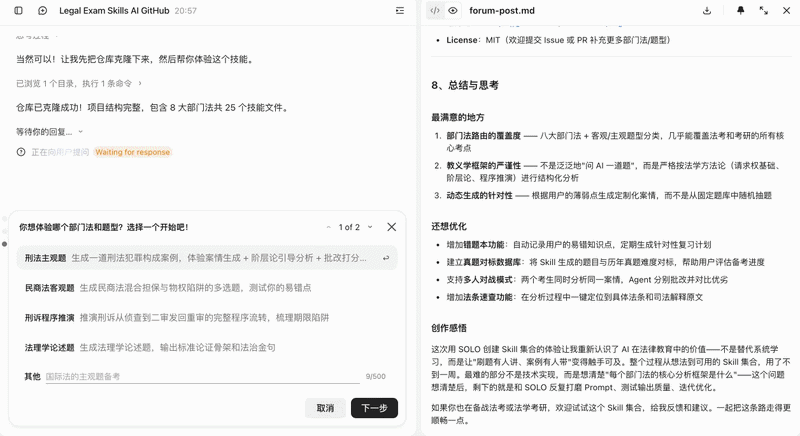
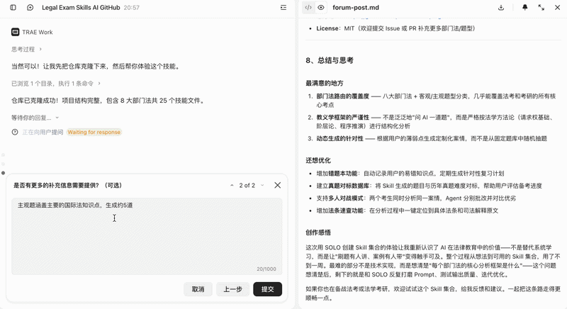
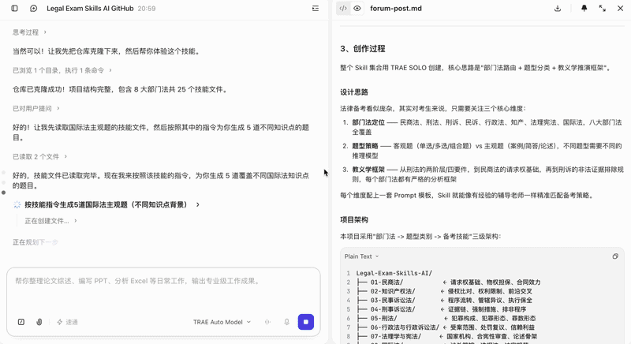
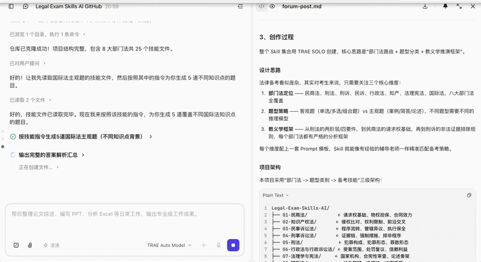
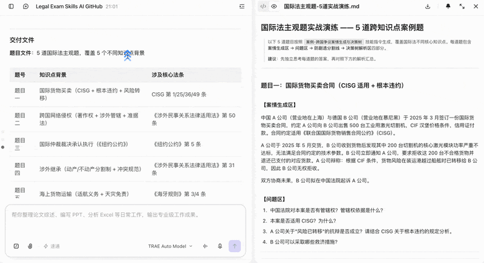

# 🏛️ Legal-Exam-Skills-AI (智能备考-法学Agent)

<div align="center">
  
  
  
</div>

<br/>

> **将法考与考研的逻辑推演，封装为可一键调用的 AI Skill。**
> 本项目专为 Trae / Cursor 等先进 AI IDE 打造，以部门法为主轴，细分客观题与主观题策略，构建严密的法律智能体路由矩阵。

## ⚡ 核心特性
- 🧠 **内置路由思维**：导入后，Agent 自动根据“部门法 -> 客观/主观题型”匹配底层推演模型。
- ⚖️ **严格教义学框架**：在批改环节引入类似于 "LLM-as-a-Judge" 的评价体系，从刑法的两阶层到民商法的请求权基础，严格校验模型输出法言法语。
- 🎯 **动态题库生成**：支持针对机械记忆难点动态生成包含陷阱的客观选择题与主观连环追问。

## 🚀 如何一键调用

### 方案 A：在 Trae / Cursor 中作为工作区导入
1. 复制本仓库链接：`https://github.com/Lillianx0221/Legal-Exam-Skills-AI`
2. 在 Trae / Cursor 中克隆并打开该文件夹。
3. 在对话框中直接输入你的案情或复习需求（例如：*“我要复习知产的侵权比对客观题”*），Agent 会自动读取 `instruction.md` 触发对应的备考 Skill。

### 方案 B：在线 Agent 平台一键导入
使用 Coze 或 Dify 时，新建 Agent，在配置页面选择**通过 GitHub 导入**，填入本仓库地址，系统将自动抓取 `instruction.md` 作为大脑进行分发。

---

## 🗂️ 技能矩阵

| 部门法 | 题型类别 | 技能文件 | 解决痛点 / 核心能力 |
| --- | --- | --- | --- |
| **01 民商法** | 客观题 | [单选-意思表示与合同效力辨析](01-民商法/01-客观题/单选-意思表示与合同效力辨析.md) | 排查效力待定、可撤销、真意保留等意思表示陷阱 |
| **01 民商法** | 客观题 | [多选-混合担保与物权陷阱测验](01-民商法/01-客观题/多选-混合担保与物权陷阱测验.md) | 辨析动产抵押与质权竞合、内部追偿权与登记对抗 |
| **01 民商法** | 主观题 | [案例-民商交叉案情动态生成器](01-民商法/02-主观题/案例-民商交叉案情动态生成器.md) | 动态生成合同、物权、担保连环嵌套案情，运用请求权基础拆解 |
| **01 民商法** | 主观题 | [简答-民法典核心制度对比](01-民商法/02-主观题/简答-民法典核心制度对比.md) | 对比债务承担与代为履行等相似制度的要件与法律后果 |
| **02 知识产权法** | 客观题 | [多选-侵权比对与权利限制测验机](02-知识产权法/01-客观题/多选-侵权比对与权利限制测验机.md) | 测试合理使用、法定许可、先用权等免责条款边界 |
| **02 知识产权法** | 主观题 | [案例-前沿知产交叉侵权分析](02-知识产权法/02-主观题/案例-前沿知产交叉侵权分析.md) | 解决 AI 数据抓取、UI 抄袭等跨著作权/反法领域的综合判定 |
| **02 知识产权法** | 主观题 | [案例-知产争议案情动态生成器](02-知识产权法/02-主观题/案例-知产争议案情动态生成器.md) | 根据给定知产考点，生成高仿真实务场景并进行抗辩推演 |
| **03 民事诉讼法** | 客观题 | [单选-普通程序法定概念精准校验](03-民事诉讼法/01-客观题/单选-普通程序法定概念精准校验.md) | 概念对齐与程序违规纠偏（如审限、举证期限届满节点辨析） |
| **03 民事诉讼法** | 客观题 | [多选-执行程序与保全陷阱测验](03-民事诉讼法/01-客观题/多选-执行程序与保全陷阱测验.md) | 针对执行异议、异议之诉、诉前保全的管辖与救济挖坑 |
| **03 民事诉讼法** | 主观题 | [案例-程序流转案情动态生成器](03-民事诉讼法/02-主观题/案例-程序流转案情动态生成器.md) | 动态生成含法院/当事人程序违法的案件，考察救济途径识别 |
| **03 民事诉讼法** | 主观题 | [案例-管辖权异议与程序救济推演](03-民事诉讼法/02-主观题/案例-管辖权异议与程序救济推演.md) | 一案到底：静态推演管辖异议、二审发回重审与再审流转图谱 |
| **03 民事诉讼法** | 主观题 | [简答-当事人与共同诉讼辨析器](03-民事诉讼法/02-主观题/简答-当事人与共同诉讼辨析器.md) | 清晰界定必要/普通共同诉讼、有独三/无独三的诉讼地位 |
| **04 刑事诉讼法** | 客观题 | [单选-强制措施与辩护权边界校验](04-刑事诉讼法/01-客观题/单选-强制措施与辩护权边界校验.md) | 拘留逮捕的转换审批主体错位、律师阅卷权受限情形打击 |
| **04 刑事诉讼法** | 客观题 | [多选-证据链与期限陷阱题生成器](04-刑事诉讼法/01-客观题/多选-证据链与期限陷阱题生成器.md) | 动态生成包含期限中断重算、非法证据排除盲点的测验 |
| **04 刑事诉讼法** | 主观题 | [案例-二审与审判监督程序流转图谱](04-刑事诉讼法/02-主观题/案例-二审与审判监督程序流转图谱.md) | 推演全面审查原则、上诉不加刑原则在发回重审中的变异适用 |
| **04 刑事诉讼法** | 主观题 | [案例-刑诉实战案情动态生成器](04-刑事诉讼法/02-主观题/案例-刑诉实战案情动态生成器.md) | 动态生成含侦查违法、一审排非与二审抗诉的全流程刑事案件 |
| **04 刑事诉讼法** | 主观题 | [案例-非法证据排除庭审实战推演](04-刑事诉讼法/02-主观题/案例-非法证据排除庭审实战推演.md) | 模拟排非程序的启动、举证责任倒置与法庭调查实战流转 |
| **05 刑法** | 客观题 | [单选-犯罪形态与罪数形态测验](05-刑法/01-客观题/单选-犯罪形态与罪数形态测验.md) | 考察未遂与中止的界限、想象竞合与结果加重犯的异常因果认定 |
| **05 刑法** | 主观题 | [案例-犯罪构成动态生成与批改引擎](05-刑法/02-主观题/案例-犯罪构成动态生成与批改引擎.md) | 动态生成多主体多次交织犯罪案情，按阶层论/四要件提供批改 |
| **06 行政法(诉讼)** | 客观题 | [多选-行政处罚与复议程序测验](06-行政法与行政诉讼法/01-客观题/多选-行政处罚与复议程序测验.md) | 打击新修处罚法/复议法中的一事不再罚、管辖级别与复议机关错位 |
| **06 行政法(诉讼)** | 主观题 | [案例-受案范围与信赖利益案情生成器](06-行政法与行政诉讼法/02-主观题/案例-受案范围与信赖利益案情生成器.md) | 动态生成行政协议违约等场景，考察适格原被告与受案范围判断 |
| **07 法理学与宪法** | 客观题 | [单选-国家机构职权越权审查测验](07-法理学与宪法/01-客观题/单选-国家机构职权越权审查测验.md) | 模拟合宪性审查，精准区分人大的决定权、任免权与监督权盲点 |
| **07 法理学与宪法** | 主观题 | [论述-法理学命题生成与标准骨架输出器](07-法理学与宪法/02-主观题/论述-法理学命题生成与标准骨架.md) | 动态生成法治热点命题，为宏观论述题注入标准模板与法治“金句” |
| **08 国际法** | 客观题 | [组合题-涉外管辖权与准据法陷阱生成器](08-国际法/01-客观题/组合题-涉外管辖权与准据法陷阱.md) | 测试国际私法中最密切联系原则、专属管辖与意思自治限制 |
| **08 国际法** | 主观题 | [案例-跨国争议案情生成与决策树引擎](08-国际法/02-主观题/案例-跨国争议案情生成与决策树.md) | 一步步推演跨国贸易/侵权纠纷的最密切联系原则与冲突规范决策树 |

---


## 🎬 实战演示
针对国际法（即将迎来考试OvO）在TRAE上使用效果如下：
<div align="center">
  
  <br><br>
  
  <br><br>
  
  <br><br>
  
  <br><br>
  
  <br><br>
  
</div>

---

## 📂 项目目录树

本项目基于本人复习路径结合Gemini指导构建目录，分为“部门法 -> 题型类别 -> 备考技能”三级架构。所列举技能仅为个别知识点备考策略，欢迎提交 Issue 或 PR 补充更多部门法或考试题型的推演策略，共同完善这棵知识树。

```text
Legal-Exam-Skills-AI/
├── README.md
├── LICENSE
├── 01-民商法/
│   ├── 01-客观题/
│   │   ├── 单选-意思表示与合同效力辨析.md
│   │   └── 多选-混合担保与物权陷阱测验.md
│   └── 02-主观题/
│       ├── 案例-民商交叉案情动态生成器.md
│       └── 简答-民法典核心制度对比.md
├── 02-知识产权法/
│   ├── 01-客观题/
│   │   └── 多选-侵权比对与权利限制测验机.md
│   └── 02-主观题/
│       ├── 案例-前沿知产交叉侵权分析.md
│       └── 案例-知产争议案情动态生成器.md
├── 03-民事诉讼法/
│   ├── 01-客观题/
│   │   ├── 单选-普通程序法定概念精准校验.md
│   │   └── 多选-执行程序与保全陷阱测验.md
│   └── 02-主观题/
│       ├── 案例-程序流转案情动态生成器.md
│       ├── 案例-管辖权异议与程序救济推演.md
│       └── 简答-当事人与共同诉讼辨析器.md
├── 04-刑事诉讼法/
│   ├── 01-客观题/
│   │   ├── 单选-强制措施与辩护权边界校验.md
│   │   └── 多选-证据链与期限陷阱题生成器.md
│   └── 02-主观题/
│       ├── 案例-二审与审判监督程序流转图谱.md
│       ├── 案例-刑诉实战案情动态生成器.md
│       └── 案例-非法证据排除庭审实战推演.md
├── 05-刑法/
│   ├── 01-客观题/
│   │   └── 单选-犯罪形态与罪数形态测验.md
│   └── 02-主观题/
│       └── 案例-犯罪构成动态生成与批改引擎.md
├── 06-行政法与行政诉讼法/
│   ├── 01-客观题/
│   │   └── 多选-行政处罚与复议程序测验.md
│   └── 02-主观题/
│       └── 案例-受案范围与信赖利益案情生成器.md
├── 07-法理学与宪法/
│   ├── 01-客观题/
│   │   └── 单选-国家机构职权越权审查测验.md
│   └── 02-主观题/
│       └── 论述-法理学命题生成与标准骨架输出器.md
└── 08-国际法/
    ├── 01-客观题/
    │   └── 组合题-涉外管辖权与准据法陷阱生成器.md
    └── 02-主观题/
        └── 案例-跨国争议案情生成与决策树引擎.md
